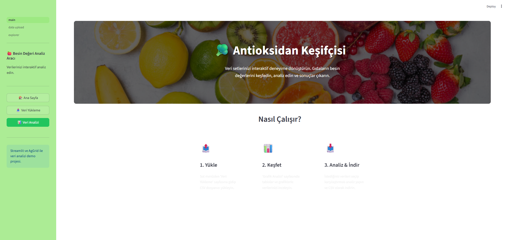
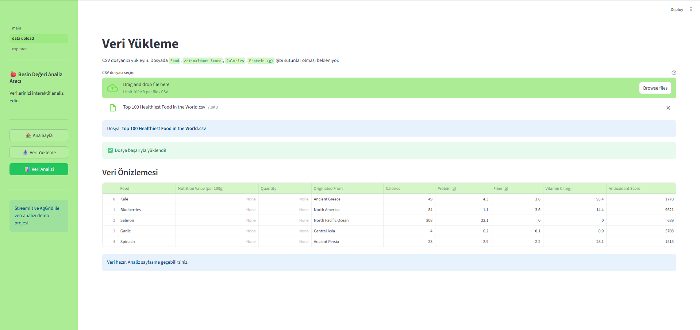
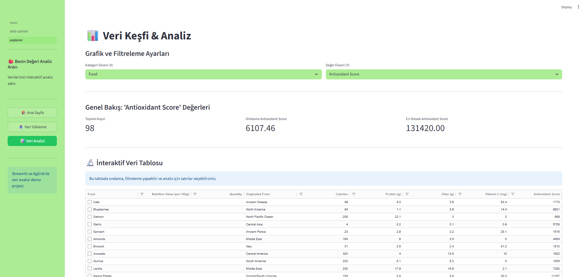
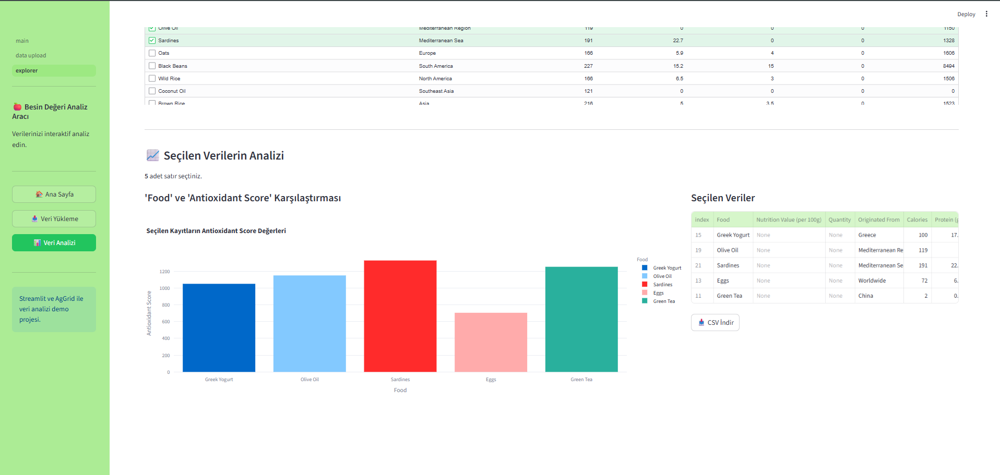

#  Besin Değeri Keşfi

Kaggle'dan alınan "Top 100 Healthiest Foods in the World" veri setini analiz etmek için geliştirilmiş interaktif Streamlit uygulaması.

##  Veri Seti
Bu uygulama [Kaggle - Top 100 Healthiest Food in the World](https://www.kaggle.com/datasets/prajwaldongre/top-100-healthiest-food-in-the-world/data) veri setini analiz etmek için tasarlanmıştır.

##  Kurulum
```bash

Özellikler

CSV dosyası yükleme ve işleme
İnteraktif veri tabloları (AgGrid)
Dinamik grafikler ve görselleştirme (Plotly)
Filtreleme ve çoklu veri seçimi
Analiz sonuçlarını CSV olarak indirme
Gıdaların antioksidan değerlerini karşılaştırma

Kullanım

Veri Yükleme: Sol menüden CSV dosyanızı yükleyin
Keşif & Analiz: İnteraktif tablolarla veri setini inceleyin
Görselleştirme: Dinamik grafiklerle karşılaştırmalar yapın
Filtreleme: İstediğiniz kriterlere göre veri seçin
İndirme: Seçtiğiniz verileri CSV formatında indirin  

Teknolojiler

Streamlit: Web arayüzü | Pandas: Veri işleme | Plotly: İnteraktif grafikler | AgGrid: Gelişmiş veri tabloları | NumPy: Sayısal hesaplamalar

Analiz Özellikleri

-Gıdaların antioksidan skorlarının karşılaştırılması
-Kalori ve protein değerlerinin analizi
-Kategorik gruplandırma ve filtreleme
-İndirilebilir istatistiksel özetler ve görselleştirmeler

Ekran Görüntüleri

Giriş Ekranı


Veri Giriş Ekranı


Analiz Sonuçları


Özet Rapor

